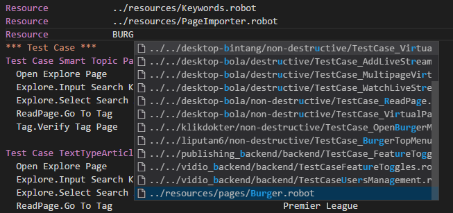
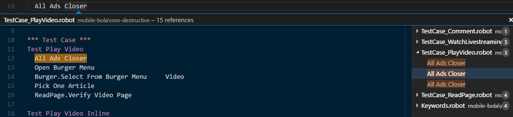
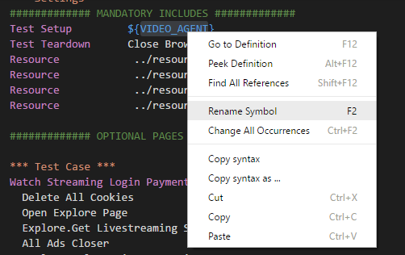

# robotf-extension README

This is Visual Studio Code extension for robot framework. this extension is still in its early stage but its fully functional.
This Extension was created for internal use for Test Engineer at KMK-Labs, but published into Visual Studio Code Extension Marketplace for everyone to use. please email me at nayanda.haberty@kmklabs.com if you found a bug or need new features, I'll try my best to deliver it.

## Features

* Keyword Autocomplete
    * it scans all the included resources and search for its keywords
    * it will suggest common keywords from BuiltIn, Selenium2Library, ExtendedSelenium2Library, and more


* Resource Autocomplete
    * it scans all resources



* Variable Autocomplete
    * it scans all the included resources and search for its global variables
    * it scans all variables from local files


* Language Autocomplete


* Find All References
    * Show all references of keywords
    * Show all references of global variables



* Keyword Definition
    * Show the original keyword location
    * ctrl + click to the keyword will bring you to the original keyword location


* Variable Definition
    * Show the original global and suite variable location
    * ctrl + click to the variable will bring you to the original variable location


* Keyword Rename
    * can rename keyword and all its reference


* Variable Rename
    * can rename global variable and all its reference



* Variable Hover
    * Hovering your mouse on global variable will give you the information about its initialization value


* Keyword Hover
    * Hovering your mouse on keyword will give you the information about its Arguments and Return Value


## Requirements

You need to have robotframework language support for visual studio code

## Known Issues

Performance issues when handle more than 300++ files in workspace

## For Contributors

You can added new suggestion library with its keywords at src/dictionary/KeywordDictionary.ts with format:
``` typescript
export var LIB =
	[
        //your new library is here
		{
			name: "libraryName", //name must be correct
			key: [ "keyword1", "keyword2" ]
        },
        ...
    ]
    
```

## Release Notes

### 1.5.0
Added reference provider

### 1.4.0
Major code restructure

### 1.3.1
Added hover provider

### 1.2.0
Added rename provider

### 1.1.0
Added definition provider

### 1.0.0
Initial release of robot framework extension