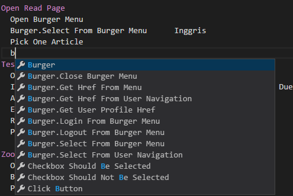
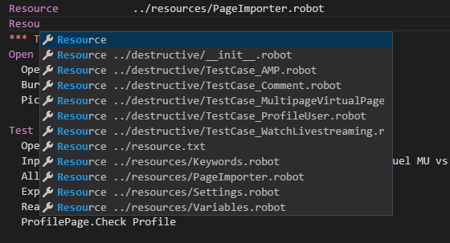
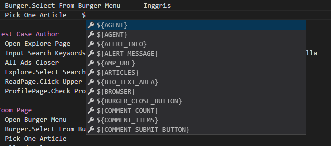
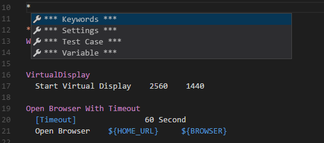

# robotf-extension README

This is visual studio extension for robot framework. this extension is still in its early stage.

## Features

* Keyword Autocomplete
    * it scans all the included resources and search for its keywords
    * it will suggest common keywords from BuiltIn, Selenium2Library, ExtendedSelenium2Library, and more

* Resource Autocomplete
    * it scans nearest resources

* Variable Autocomplete
    * it scans all the included resources and search for its global variables
    * it scans all variables from local files

* Language Autocomplete

## Requirements

You need to have robotframework language support for visual studio code

## Known Issues

Performance issues when handle more than 350++ files in workspace

## Release Notes

Initial release

### 1.0.0

Initial release of robot framework extension